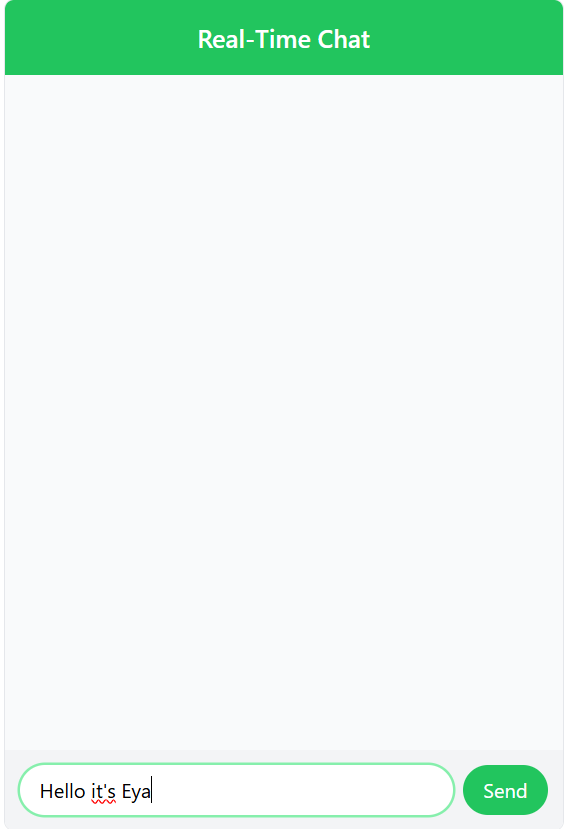
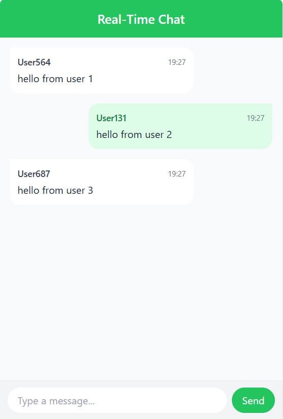

# 💬 Real-Time Chat App – Frontend

This is the **React.js frontend** for the Real-Time Chat Application. It communicates with a NestJS WebSocket server to enable real-time message exchange between users.


## 🚀 Features

- Built with **React** and **TypeScript**
- Real-time Messaging via **Socket.IO client**: Instantly send and receive messages without refreshing the page.
- Dynamic User Interface: Responsive and modern design with user-specific details.
- Functional components using `useState` and `useEffect`
- Event-driven communication with the backend
- Error Handling: Logs errors and prevents invalid operations.

Session Management: Ensures authenticated access for users.

## 🛠 Tech Stack

- React.js: building interactive user interfaces using components and hooks for state management.
- JavaScript: Dynamic client-side interactions.
- Socket.IO Client: Abstraction layer that offers features like server and socket functions
- Vite : for development tooling 

## 📦 How to run
### 1. clone the repository :
    git clone https://github.com/Eya-ben-aziza/App-Chat-Frontend.git
      cd App-Chat-Frontend
### 2. install dependencies:
```bash
npm install
```
### 3. configure the backend:
    make sure the backend WebSocket server is running at http://localhost:3000
    check the backend README.md file for reference as setup instructions in this URL: https://github.com/Eya-ben-aziza/app-chat-backend.git    
### 4. run the project: 
```bash
    npm run start
```
**The app will usually be available at http://localhost:3001


## UI Screenshots:

